# laa-pdf-ai-hackathon

A tool for legal aid providers to digitise hand-filled CW1 forms (page 1 only) using AI-powered field extraction.

## What this does

Legal aid providers photograph a completed CW1 form (page 1). The tool extracts the handwritten field values using Google Gemini and presents them in a GOV.UK "check your answers" style review screen. The provider reviews and corrects any errors (sitting with the client), then confirms the data to produce a printable structured summary. Submission is simulated.

### Flow

1. Provider uploads a photo of the completed CW1 page 1
2. Spring Boot backend receives the image and forwards it to Gemini with a structured prompt including the expected JSON schema
3. Gemini returns extracted field values as JSON
4. Frontend renders a GOV.UK "check your answers" style review screen
5. Provider reviews and corrects any errors
6. Confirmed data produces a printable structured summary

### Fields extracted (CW1 page 1)

- **Exceptional Case Funding** — yes/no flag
- **Equal Opportunities**
  - Ethnicity (single select from enumerated list)
  - Disability (multi-select, or "not considered disabled" / "prefer not to say")
- **Client details** — title, initials, surname, first name, surname at birth, date of birth, NI number, sex, marital status, place of birth, job, current address and postcode

### Roadmap

- **Phase 1 (MVP)** — Extract and display raw field values in the review UI; no confidence ratings
- **Phase 2** — Add per-field confidence scores to the Gemini response schema; use these in the frontend to flag uncertain fields (amber highlight + "please verify" prompt on low-confidence fields)
- **Phase 3 (stretch)** — Send a GOV.UK Notify email to the caseworker with a structured summary and CMS deep link, with an optional PDF attachment

## Service flow



See [happy and unhappy paths](docs/happy-unhappy-paths.md) for how the tool behaves across different scenarios — from a clear image and smooth submission through to Gemini errors, failed notifications, and ambiguous handwriting.

For a step-by-step walkthrough of the UI with annotated screenshots, see the [user flow walkthrough](docs/user-flow.md).

---

## Requirements

- Java 21+
- Gradle (wrapper included)
- Docker (optional)
- A [Google Gemini API key](https://aistudio.google.com/app/apikey) (free tier)

---

## Configuration

### Gemini API Key
The service requires a Gemini API key to extract data from images.
Get a free key at [Google AI Studio](https://aistudio.google.com/app/apikey) — no billing required for the free tier.

Set it as an environment variable before running:

```bash
export GEMINI_API_KEY=your_key_here
```

### GOV.UK Notify API Key
The service integrates with GOV.UK Notify for sending emails.
Get your API key from the [GOV.UK Notify dashboard](https://www.notifications.service.gov.uk/).

Set it as an environment variable:

```bash
export NOTIFY_API_KEY=your_notify_api_key_here
```

Or use the test key from `.env` file:
```bash
source .env
```

---

## Build & Run

### Build
```bash
./gradlew clean build
```

### Run locally
```bash
./gradlew bootRun
```

### Run with local profile (human-readable console logs)
```bash
./gradlew bootRun --args='--spring.profiles.active=local'
```

### Run via Docker
```bash
docker compose up
```

---

## API Endpoints

Base URL: `http://localhost:8081`

### Swagger UI
`http://localhost:8081/swagger-ui/index.html`

### Health Check
```bash
curl http://localhost:8181/actuator/health
```

### Send Sample Email (GOV.UK Notify)
```bash
curl -X POST "http://localhost:8081/api/notify/send-sample-email?emailAddress=test@example.com"
```

**Note:** You need to create a template in your GOV.UK Notify account and update the `templateId` in `NotifyService.java`.

---

## Image Upload

### `POST /api/v1/image`

Accepts a `multipart/form-data` request containing an image file and submitter email address.
Returns `201 Created` with the unique ID of the submission.

#### Request fields

| Field   | Type   | Required | Description                    |
|---------|--------|----------|--------------------------------|
| `image` | file   | Yes      | The image file to be processed |
| `email` | string | Yes      | Email address of the submitter |

#### Example curl

```bash
curl -X POST http://localhost:8081/api/v1/image \
  -F "image=@/path/to/your/image.jpg" \
  -F "email=user@example.com"
```

#### Example response

```json
{
  "id": "a3f1c2d4-89ab-4def-b012-3456789abcde",
  "extractedData": {
    "Client Name": "Jane Smith",
    "Date of Birth": "01/06/1985",
    "National Insurance Number": "AB123456C",
    "Solicitor Firm": "Smith & Co Solicitors",
    "Category of Law": "Family"
  }
}
```

HTTP status: `201 Created`
`Location` header: `/api/v1/image/a3f1c2d4-89ab-4def-b012-3456789abcde`

---

## Items API

A basic CRUD API is also available at `/api/v1/items`. See the Swagger UI for full details.
